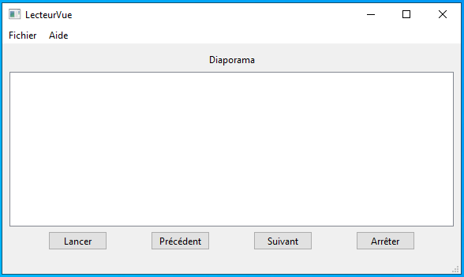

# SAE DEVELOPPEMENT APPLICATION IHM - IUT BAYONNE PAYS BASQUE

## Description de l'application
Il s'agit d'un lecteur de diaporama, c'est-à-dire une application permettant d'afficher
des images sous la forme d'un diaporama.
Le lecteur affiche les images du diaporama en cours. Chaque image est affichée accompagnée
de son intitulé / titre, de la catégorie à laquelle elle appartient, et de son rang au
sein du diaporama.

-----
### Deux modes de fonctionnement
* mode Manuel : L'image courante (et les informations qui l'accompagnent) restent affichées
                tant que l'utilisateur ne fait rien. Deux boutons (flèches << suivant >> et
                << précédent >>) permettent de passer manuellement à l'image suivante ou 
                précédente. Une fois sur la dernière image, le bouton << suivant >> 
                affiche la première image. De même, une fois sur la première image, le bouton
                << précédent >> affiche la dernière image.
                
* mode Auto : Les images défilent automatiquement, à raison de 1 image toutes les 2 secondes.
              Le défilement automatique va uniquement vers l'avant, et démarre toujours à 
              partir de la première image. L'affichage automatique 'boucle' : après la dernière
              image, l'application affiche à nouveau la première image.
             
-----
### Passage du mode Manuel au mode Auto et inversement
A tout moment, il est possible de passer du mode Manuel au mode Auto, et inversement.
* Si l'on est en mode Manuel, le lancement du diaporama en mode Auto est possible, par clic
  sur le bouton << Lancer >>. Le défilement automatique démarre à la première image du 
  diaporama.
  
* Si l'on est en mode Auto, la relance du diaporama en mode Auto est possible, par clic 
  sur le bouton << Lancer >>. Le défilement automatique redémarre à la première image.
  
* Si l'on est en mode Auto, l'arrêt du diaporama automatique et le passage en mode Manuel est
  possible, par clic sur le bouton << Arrêter >>, ou bien sur un des deux boutons << Suivant >>
  / << Précédent >>. Le défilement automatique s'arrête, l'image qui était en cours d'affichage
  au moment du passage en mode Manuel reste affichée... jusqu'à ce que l'utilisateur décide 
  d'intéragir à nouveau avec l'application.

* Si l'on est en mode Manuel, le bouton << Arrêter >> est inactif.

-----
### Démarrage de l'application
* L'application démarre toujours en mode Manuel. Le mode de fonctionnement en cours est toujours
  affiché sur la barre de status.
  
* Lors du lancement de l'application, le lecteur est 'vide', à savoir aucun diaporama n'est chargé.
  Un menu << Paramètres -> Charger diaporama >> permet de sélectionner le diaporama souhaité dans une
  base de données. L'application charge alors en mémoire le contenu du diaporama, c'est-à-dire son 
  intitulé, ainsi que la liste des images qui lui sont associées.
  
---
